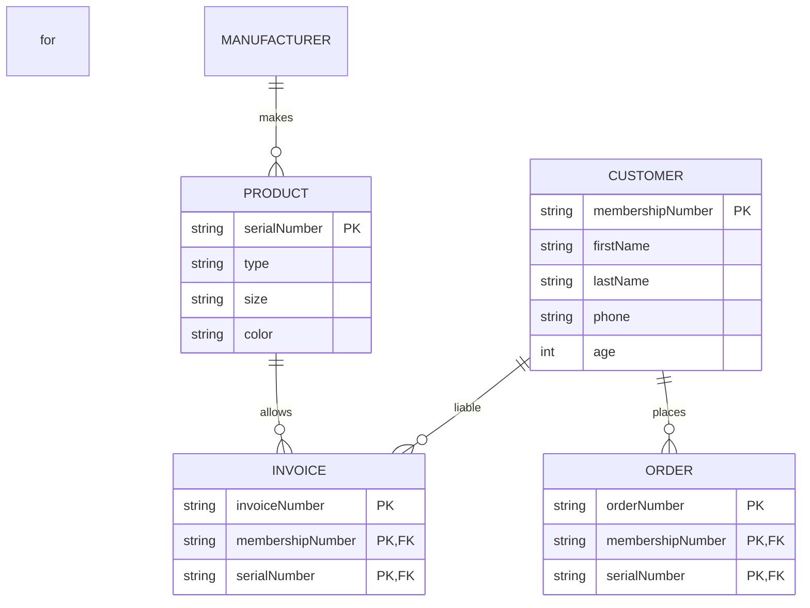

# NikeStore_ERD.md
Understand the Business Context:
o *Products: Represents different models of Nike shoes sold in the store.
o Customers: Details about customers who purchase shoes.
o Sales: Transaction records linking customers and the products they buy.
o Inventory: Tracks the stock levels of various shoe models.

