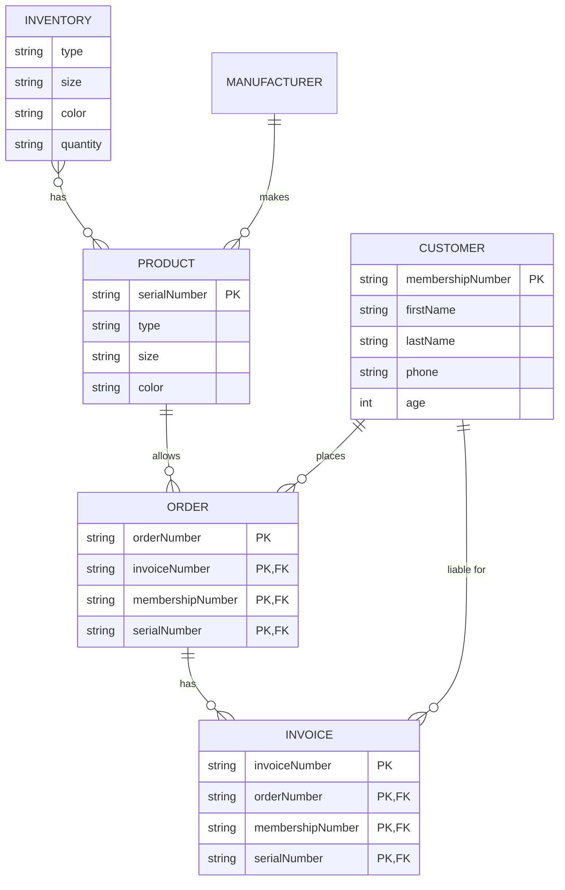

# NikeStore_ERD.md

The entities I have made are PRODUCT, INVENTORY, CUSTOMER, ORDER, and INVOICE (SALES)
 * Product: an article or substance that is manufactured or refined for sale.
 * Inventory: a complete list of items such as property, goods in stock, or the contents of a building.
 * Customer: a person or organization that buys goods or services from a store or business.
 * Order: a formal request made by a buyer to a seller indicating what they want to purchase and how much they are willing to pay.
 * INVOICE: a document that outlines goods or services provided by a seller to a buyer, including the price and terms of sale.  
**Definitions from [Google](https://www.google.com/)**

Product to Invoice relationship - **Invoices** are sales made to customers and have lists of **products** purchased.
Inventory to Product relationship - **Inventories** are lists of items such as **products** that detail inforation such as quantity on hand, product characteristics, and pricing.
Customer to Order relationship - **Customers** can place one or many **orders** which have lists of products purchased.
Customer to Invoice relationship - **Customers** orders have associated **invoices** that lists money to be paid for the products purchased.
Order to Invoice relationship - **Orders* always have associated **invoices**
